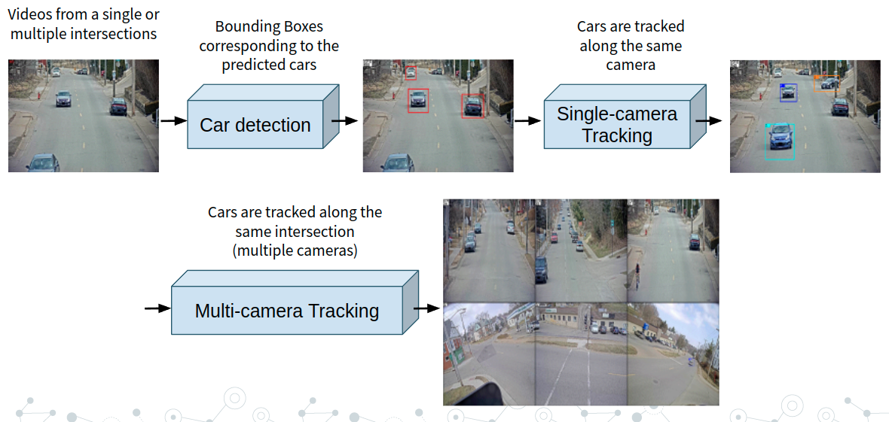

# TrackNet: A Triplet metric-based method for Multi-Target Multi-Camera Vehicle Tracking

This paper is devoted to explore Computer Vision video techniques to track cars across multiple cameras at a single intersection and multiple intersections spreading out in a mid-size city and find the best performing algorithm.

The dataset used is a subset of 3 sequences of the *AI City dataset*. This dataset offers 3.25 hours of videos showing road intersections and driving vehicles. 40 cameras were used in 10 different intersections. The dataset also offers the frame-by-frame bounding boxes of each vehicle, giving a total of 229,680 bounding boxes for 666 different vehicles.


## Introduction

In this repository we present *TrackNet*, a model capable of detecting and tracking cars across intersections in more than one camera. The model is based on a Faster R-CNN with ResNeXt101 backbone, Deep SORT with some refinements and Triplet Metric Learning with ResNet50 backbone for the object Re-ID.

The model pipeline is the following:



All the model justification and results are in the following slides: [SLIDES](https://docs.google.com/presentation/d/1hbSbUkJ5XG_9_Yyj9-YAxtO10loXa0TE8gJzPEHQc4k/edit?usp=sharing)

Or in the following paper: [Paper](https://arxiv.org/abs/2205.13857)

## Car Detection

The first step of the model is to run a fine-tuned Faster R-CNN with ResNext101 backbone to predict the position of the cars frame-by-frame with their bounding boxes. We reach a top **Average Precision of 0.9852** on the c010 of S03.

## Single-camera Tracking

Once the cars are detected we tested several tracking algorithms (Max Overlap, SORT, Deep SORT) to track and relate the bounding boxes which are from the same car along the frames. The best performing technique was Deep SORT with an **average IDF1 of 0.7447** over all the sequences.

## Multi-camera Tracking

Once all the cars have been assigned to a track along the same camera, TrackNet relates them to be able to identify the same car in different cameras.

To do so, the model uses a Triplet Network with ResNet50 as backbone to implement Deep Metric Learning computing features from every tracklet. Once each tracklet has an embedding the Re-ID model matches all the similar tracklets from different cameras ensuring a cross-match condition. **TrackNet is able to achieve and average IDF1 of 0.4733**.

## Installation

This code is implemented in Python3.6+, [Detectron2](https://github.com/facebookresearch/detectron2) and [Pytorch](https://pytorch.org/)


## Run the System

If you want to reproduce our results, please download the datasets from [AI City Challenge 22](https://www.aicitychallenge.org/2022-data-and-evaluation/) and put them in a folder called *data* outside the repository folder:

```
├── data
   ├── AICity_data
      ├── train
         ├── S01
         ├── S03
         ├── S04
         
├── tracknet
  ├── main.py
  ├── AICity.py
     ...
  ├── utilities
```

The user has the ability to select which training sequences (S01, S03...) want by switching the *train_seq* parameter of the *AICity* object in the *main.py* file. The pipeline creates a data folder inside the root folder in which all the predictions are stored divided in different folders depending on the training sequences. Furthermore, the user has the ability of running just some parts of the pipeline just by commenting the corresponding lines of the *main.py* file.

So to run *TrackNet* run:
```
$ python main.py
```

## Citing the paper
```
@article{2022tracknet,
  title={TrackNet: A Triplet metric-based method for Multi-Target Multi-Camera Vehicle Tracking},
  author={Serrano, David and Net, Francesc and Rodr{\'\i}guez, Juan Antonio and Ugarte, Igor},
  journal={arXiv preprint arXiv:2205.13857},
  year={2022}
}
```


